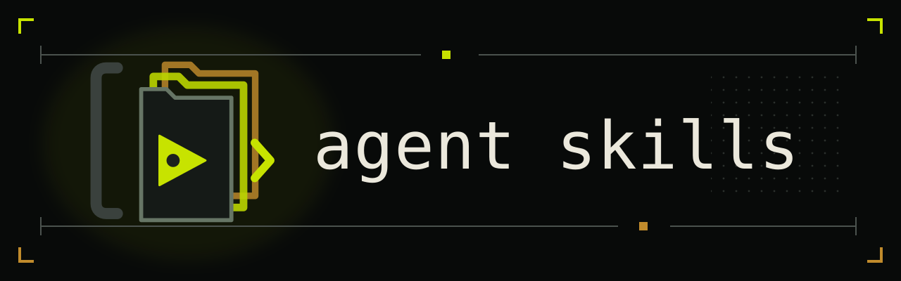

# Agent skills



A collection of vendor-agnostic [agent skills](https://agentskills.io) focused
on coordination and orchestration. Skills install into a `.agents/skills/`
directory, following the [.agents protocol](https://dotagentsprotocol.com/).

## Skills

| Skill | What it does |
| --- | --- |
| [`casebook`](skills/casebook/) | Work within a project's *casebook*, a directory of "cases", each a bounded unit of work (investigation, design, feature) with its own metadata and files. |
| [`iac`](skills/iac/) | Inter-agent communication, using a filesystem channel for agents working in parallel to coordinate over shared files. |
| [`delegate`](skills/delegate/) | Spawn another agent, using a different CLI tool, model, or a fresh headless session, to carry out a task based on a user-maintained guide to the available tools. |
| [`lead`](skills/lead/) | Take the lead on a goal, hold the high-level objective, and steer by delegating significant work to other agents. |
| [`report-skill-feedback`](skills/report-skill-feedback/) | Send a skill's author a feedback report on how their skill behaved in real use, when the skill ships reporting instructions. |

Each skill is rooted at its `SKILL.md`. A companion `README.md` provides a
human-facing explanation.

## Install

Clone the repo and run the installer. It copies skills into `~/.agents/skills/`:

```sh
git clone https://github.com/ArielHorwitz/agent-skills
cd agent-skills
./install.sh              # all skills
./install.sh casebook     # just one
./install.sh --list       # see what's available
```

Use `--dest DIR` to install elsewhere (e.g. a project's `.agents/skills`).
An already-installed skill is left alone unless you pass `--upgrade` (alias
`--force`), which removes the existing skill directory and reinstalls it fresh,
so `git pull` then `./install.sh --upgrade` is the update path. Full flags:
`install.sh --help`.

For vendor-specific setup, see [Vendor compatibility](#vendor-compatibility).

## Vendor compatibility

This repository keeps `.agents/` canonical. It bridges vendor-specific paths to
that directory with symlinks, never copies.

The local CLI behavior below was observed with Claude Code 2.1.258 and Codex CLI
0.153.4.

| Concern | Claude Code 2.1.258 | Codex CLI 0.153.4 |
| --- | --- | --- |
| Global instructions | Bridged: `~/.claude/CLAUDE.md` | Bridged: `$CODEX_HOME/AGENTS.md` |
| Project instructions | Bridged: `.claude/CLAUDE.md` | Bridged: `AGENTS.md` (config alternative below) |
| Global skills | Bridged: `~/.claude/skills` | Native: `~/.agents/skills` |
| Project skills | Bridged: `.claude/skills` | Native: `.agents/skills` |
| Explicit-only invocation | Native vendor control in `SKILL.md` | Native vendor control in `agents/openai.yaml` |

Use `bridge.sh` with `claude`, `codex`, or `all`. The directory defaults to the
current directory:

```sh
./bridge.sh all ~             # bridge home configuration
./bridge.sh all               # bridge the current project
./bridge.sh codex /path/to/project
```

Every mode scaffolds `.agents/skills/` and `.agents/agents.md` when missing.
Claude mode links `.claude/skills` and `.claude/CLAUDE.md` into `.agents/`.
Codex mode links a project's `AGENTS.md`, or `$CODEX_HOME/AGENTS.md` when the
directory is your home. Codex needs no skill link because it reads
`.agents/skills` natively. `all` applies both modes.

The script never replaces an existing file, directory, or different symlink.
It reports each skipped path and exits with status 1 after checking everything.
A successful rerun reports existing correct links as `ok`, so rerunning is
safe.

For Codex project instructions, you can configure this alternative in
`~/.codex/config.toml`:

```toml
project_doc_fallback_filenames = [".agents/agents.md"]
```

This avoids a root `AGENTS.md` symlink, but it is user-level configuration that
does not travel with a fresh clone. The symlink is the default bridge because
it is repository-local and also works for other tools that read `AGENTS.md`.

Known gaps:

- The whole-directory `.claude/skills` symlink works in Claude Code 2.1.258
  but is not a documented guarantee. The docs promise only that individual
  skill entries may be symlinks.
- Claude Code on the web only sees committed project configuration.
- Desktop Cowork skips a home instruction symlink whose target is outside the
  session directory.
- Codex cloud parity for `.agents/skills` and `agents/openai.yaml` is
  unverified.

## Model invocation

The Agent Skills specification does not define a control for model invocation.
Claude Code reads `disable-model-invocation: true` in `SKILL.md` frontmatter.
Codex ignores that field and instead reads `agents/openai.yaml` with
`policy.allow_implicit_invocation: false`.

Skills in this repository that are explicit-only ship both controls. To change
a skill's behavior for one vendor, edit that vendor's control: drop the
frontmatter line to let Claude Code trigger it, or delete the sidecar (or set
its value to `true`) to let Codex trigger it. Upgrading the skill with
`install.sh --upgrade` overwrites local changes.
